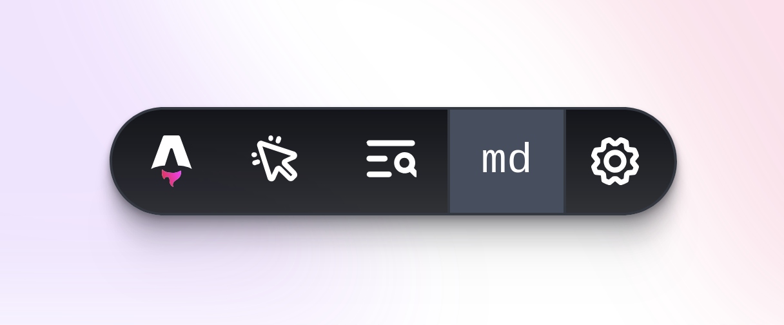

# astro-show-tailwindcss-breakpoint

> Show the current [Tailwind CSS][tailwindcss] breakpoint in the [Astro][astro] dev toolbar!

- **Helpful** - Quick reference for the current breakpoint!
- **Simple** - Just an extra icon on the existing dev toolbar!
- **Small** - No dependencies!
- **Fast** - No client-side JavaScript, only an SVG icon!

[][latest-release]
[][package-on-npm]
[][package-on-jsr]
[][package-on-bundlejs]



```typescript
import { defineConfig } from "astro/config";
import showTailwindCSSBreakpoint from "astro-show-tailwindcss-breakpoint";

export default defineConfig({
  integrations: [
    showTailwindCSSBreakpoint({
      /* Optionally define custom breakpoints: */
      // breakpoints: {
      //   "sm": "40rem",
      //   "md": "48rem",
      //   "lg": "64rem",
      //   "xl": "80rem",
      //   "2xl": "96rem",
      // },
    }),
  ],
});
```

## Installation

Add the integration to your Astro project using the `astro add` command.  
This will install the adapter and make the appropriate changes to your
`astro.config.mjs`/`astro.config.ts` file in one step:
```bash
npx astro add astro-show-tailwindcss-breakpoint
```
If you prefer to install the integration manually instead, complete the
following two steps:
1. Install the integration to your project’s dependencies using your preferred
   package manager.  
   If you’re using npm or aren’t sure, run this in the terminal:
   ```bash
   npm install --save-dev astro-show-tailwindcss-breakpoint
   ```
   Or, if you're using Deno, run this in the terminal:
   ```bash
   deno add jsr:@jonasgeiler/astro-show-tailwindcss-breakpoint
   ```
2. Add the integration to your `astro.config.mjs`/`astro.config.ts` file:
   ```typescript
   import { defineConfig } from "astro/config";
   
   // ADD THE FOLLOWING LINE:
   import showTailwindCSSBreakpoint from "astro-show-tailwindcss-breakpoint";

   export default defineConfig({
     // ...
     integrations: [
        // ...
   
        // ADD THE FOLLOWING LINE:
        showTailwindCSSBreakpoint(),
     ],
     // ...
   });
   ```

## Usage

Once installed, the integration will automatically add a new icon to the
Astro dev toolbar. The icon will show the current Tailwind CSS breakpoint
based on the current viewport width.

> [!TIP]
> You can click on the breakpoint icon to keep the dev toolbar open!
> This is useful if you want to see the breakpoint name while resizing
> the viewport.

### Custom Breakpoints

You can optionally define custom breakpoints to use in the dev toolbar.  
By default, the breakpoints are:
- `sm`: `"40rem"` (640px with a root font size of 16px)
- `md`: `"48rem"` (768px with a root font size of 16px)
- `lg`: `"64rem"` (1024px with a root font size of 16px)
- `xl`: `"80rem"` (1280px with a root font size of 16px)
- `2xl`: `"96rem"` (1536px with a root font size of 16px)

These breakpoints are based on the [default Tailwind CSS breakpoints][tailwindcss-breakpoints].

You can override the default breakpoints by passing a `breakpoints` option with
an object containing the breakpoints you want to use. The keys of the
object should be the breakpoint names, and the values should be the sizes
of the breakpoints in any preferred CSS unit (`px`, `rem`, `em`, `%`, etc.).
If a number is provided, it will be treated as `px` by default.

> [!IMPORTANT]
> Make sure to use the same units for all breakpoints, otherwise the
> sorting will not work as expected.

```typescript
import { defineConfig } from "astro/config";
import showTailwindCSSBreakpoint from "astro-show-tailwindcss-breakpoint";

export default defineConfig({
  integrations: [
    showTailwindCSSBreakpoint({
      breakpoints: {
        "sm": "640px",
        "md": "768px",
        "lg": "1024px",
        "xl": "1280px",
        "2xl": "1536px",
      },
    }),
  ],
});
```

## Credits

This integration was partly inspired
by [astro-devtool-breakpoints][astro-devtool-breakpoints]
by [Bryan Schuetz (@BryanSchuetz)][@BryanSchuetz].

[@BryanSchuetz]: https://github.com/BryanSchuetz
[astro-devtool-breakpoints]: https://github.com/BryanSchuetz/astro-breakpoints
[astro]: https://astro.build/
[latest-release]: https://github.com/jonasgeiler/astro-show-tailwindcss-breakpoint/releases/latest
[package-on-bundlejs]: https://bundlejs.com/?q=astro-show-tailwindcss-breakpoint
[package-on-jsr]: https://jsr.io/@jonasgeiler/astro-show-tailwindcss-breakpoint
[package-on-npm]: https://www.npmjs.com/package/astro-show-tailwindcss-breakpoint
[tailwindcss-breakpoints]: https://tailwindcss.com/docs/responsive-design#overview
[tailwindcss]: https://tailwindcss.com/
